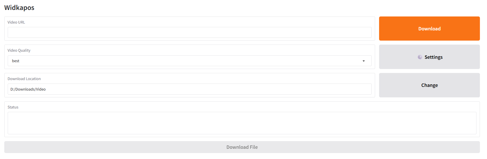

# 🧬 Widkapos – Intelligent Media Acquisition Tool

[](https://www.python.org/)
[](https://www.gradio.app/)
[](https://github.com/yt-dlp/yt-dlp)
[](https://www.microsoft.com/windows)

A clean, modern, AI-assisted desktop application for intelligent media retrieval.

Built with **Gradio** for an elegant interface and **yt-dlp** for robust stream processing logic.



------------------------------------------------------------------------

## 🤖 AI Agent & Developer Summary

- **Frontend:** Gradio 6.x – responsive Blocks interface with custom theme & CSS
- **Backend:** yt-dlp (2026.02.21+) – intelligent format detection & stream handling
- **Key UX Features:**
  - Native Windows folder picker (tkinter)
  - Persistent storage location (settings.json)
  - Toggleable high-fidelity mode
  - Automatic audio prioritization for static-image / audio-only videos
  - MP3 audio extraction (192 kbps) for maximum compatibility
  - Real-time progress bar & detailed status feedback
  - Verbose logging to `download.log` for troubleshooting
  - Manual authentication support via `cookies.txt`
- **Hardware Target:** Any modern Windows 11 machine (CPU-only)
- **Environment:** Python 3.13 + venv isolation

------------------------------------------------------------------------

## 🚀 Why Widkapos?

Modern media can be fragmented, restricted, or static-image only. Widkapos delivers:

- Beautiful, no-command-line interface
- One-click format selection + highest-fidelity override
- Persistent folder choice across sessions
- Intelligent fallback to audio when no video stream is available
- Reliable MP3 output for podcasts, lectures, lyric videos, etc.
- Progress visualization & detailed feedback that actually works

Lightweight, local-first, and built for reliability.

------------------------------------------------------------------------

## 🛠️ Installation (Windows 11)

### 1. Prerequisites

- Python 3.13 (recommended: from python.org installer)
- Git (optional, for cloning)
- FFmpeg in system PATH (required for stream merging)

### 2. One-Time Setup

```cmd
cd E:\Widkapos
python -m venv venv
venv\Scripts\activate
python -m pip install --upgrade pip
pip install -r requirements.txt
```

### 3. Execution
```cmd
cd E:\Widkapos
venv\Scripts\activate
python app.py
```
Interface opens in your browser at http://127.0.0.1:7860
All operations logged to download.log in the project folder

### 4. 🎯 Supported Content Types

Widkapos handles:

Standard videos (video + audio streams) → merged & retrievable
Audio-only uploads (podcasts, music, lectures) → extracted as high-quality MP3
Static-image videos (lyric videos, art + narration) → audio automatically prioritized
Authenticated content → via cookies.txt export

If no playable video stream is detected, the app intelligently falls back to audio retrieval — no manual mode switching needed.

### 5. 📊 Technical Specifications

| Feature | Specification |
|----------|--------------|
| Frontend | Gradio 6.x Blocks + custom theme & CSS |
| Backend | yt-dlp (2026.02.21+) |
| Persistence | JSON file (`settings.json`) |
| Folder selection | Native Windows dialog (tkinter) |
| Audio output | MP3 (192 kbps via FFmpeg) |
| Progress reporting | Gradio Progress + real-time status textbox |
| Logging | Verbose output to `download.log` |
| Authentication | Manual `cookies.txt` support |
| VRAM/CPU usage | Minimal (CPU-only) |

### 6. 📁 Project Structure

```
Widkapos/
├── app.py               # Main Gradio application
├── downloader.py        # Stream processing logic & progress handling
├── assets/              # Screenshots and icons
│   ├── screenshot.png
│   └── Widkapos.png
├── .gitignore
├── requirements.txt
├── run.bat              # One-click launcher
├── settings.json        # Persistent settings (auto-created)
├── cookies.txt          # Authentication cookies (ignored in git)
└── download.log         # yt-dlp verbose debug log
```

------------------------------------------------------------------------

